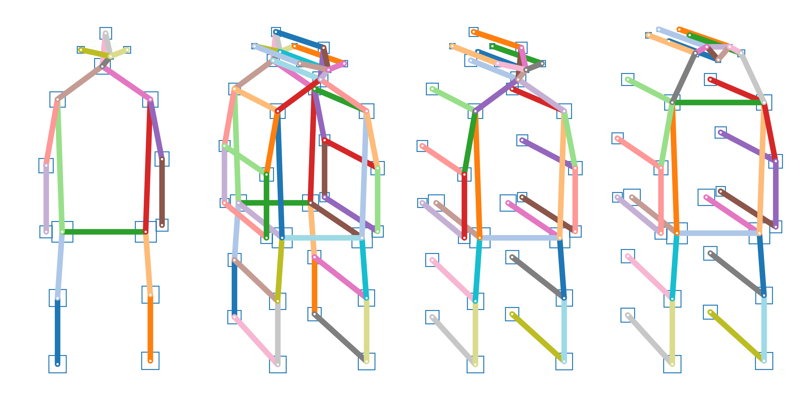

# The code has been migrated directly into the main [OpenPifPaf](https://github.com/openpifpaf/openpifpaf) repository. The documentation hasn't been moved yet from this repo to the guide in OpenPifPaf so I am keeping this repository for now.

[](https://github.com/vita-epfl/openpifpaf_posetrack/actions/workflows/tests.yml)

This is the tracking plugin for [OpenPifPaf](https://github.com/vita-epfl/openpifpaf).<br />
[__New__ 2021 paper](https://arxiv.org/abs/2103.02440):

> __OpenPifPaf: Composite Fields for Semantic Keypoint Detection and Spatio-Temporal Association__<br />
> _[Sven Kreiss](https://www.svenkreiss.com), [Lorenzo Bertoni](https://scholar.google.com/citations?user=f-4YHeMAAAAJ&hl=en), [Alexandre Alahi](https://scholar.google.com/citations?user=UIhXQ64AAAAJ&hl=en)_, 2021.
>
> Many image-based perception tasks can be formulated as detecting, associating
> and tracking semantic keypoints, e.g., human body pose estimation and tracking.
> In this work, we present a general framework that jointly detects and forms
> spatio-temporal keypoint associations in a single stage, making this the first
> real-time pose detection and tracking algorithm. We present a generic neural
> network architecture that uses Composite Fields to detect and construct a
> spatio-temporal pose which is a single, connected graph whose nodes are the
> semantic keypoints (e.g., a person's body joints) in multiple frames. For the
> temporal associations, we introduce the Temporal Composite Association Field
> (TCAF) which requires an extended network architecture and training method
> beyond previous Composite Fields. Our experiments show competitive accuracy
> while being an order of magnitude faster on multiple publicly available datasets
> such as COCO, CrowdPose and the PoseTrack 2017 and 2018 datasets. We also show
> that our method generalizes to any class of semantic keypoints such as car and
> animal parts to provide a holistic perception framework that is well suited for
> urban mobility such as self-driving cars and delivery robots.

Previous [CVPR 2019 paper](http://openaccess.thecvf.com/content_CVPR_2019/html/Kreiss_PifPaf_Composite_Fields_for_Human_Pose_Estimation_CVPR_2019_paper.html).


# Install

```sh
pip install 'openpifpaf_posetrack[test,train]'

# from source:
pip install --editable '.[test,train]'
```


# Prediction

The standard `openpifpaf.video` still works exactly the same way. With this
plugin installed, you can use `--checkpoint=tshufflenetv2k16` (with a `t` at the
beginning). This model can be decoded in multiple ways and you should pick one
decoder. To get started, we recommend `--decoder=trackingpose:0`.
Putting it all together, an example command to process a video stream from a
camera is:

```sh
MPLBACKEND=macosx python3 -m openpifpaf.video --show --long-edge=321 --checkpoint=tshufflenetv2k16 --decoder=trackingpose:0 --source 0 --horizontal-flip
```


# Posetrack Dataset

Data. Follow the Posetrack instructions to download and untar the images.
Labels:

```sh
mkdir data-posetrack
cd data-posetrack
wget https://posetrack.net/posetrack18-data/posetrack18_v0.45_public_labels.tar.gz
tar -xvf posetrack18_v0.45_public_labels.tar.gz
mv posetrack_data/* .
rm -r posetrack_data
```

Generate PoseTrack2017 json data of the ground truth.
Usage of `octave` instead of `matlab` is not documented, but this seems to work:

```sh
cd matlab
octave --no-gui --eval "addpath('./external/jsonlab'); mat2json('your_relative_path/data-posetrack2017/annotations/val/'); quit"
```

This takes a long time. It is faster on the test set:

```sh
octave --no-gui --eval "addpath('./external/jsonlab'); mat2json('your_relative_path/data-posetrack2017/annotations/test/'); quit"
```

The Posetrack poses look like these:



Created with `python -m openpifpaf_posetrack.draw_poses`.


# Train posetrack2018-cocokpst

```sh
# 210226

# first convert from single image to tracking model
python3 -m openpifpaf_posetrack.imagetotracking --checkpoint shufflenetv2k30

# train
time python3 -m torch.distributed.launch --nproc_per_node=4 \
  -m openpifpaf.train --ddp \
  --lr=0.0003 --momentum=0.95 --b-scale=10.0 \
  --epochs=50 --lr-decay 40 45 --lr-decay-epochs=5 \
  --batch-size=8 \
  --weight-decay=1e-5 \
  --dataset=posetrack2018-cocokpst --dataset-weights 1 1 --stride-apply=2 \
  --posetrack-upsample=2 \
  --cocokp-upsample=2 --cocokp-orientation-invariant=0.1 --cocokp-blur=0.1 \
  --checkpoint outputs/tshufflenetv2k30-210217-075056-cocokp-o10s-6f9daa84.pkl
```

```sh
CUDA_VISIBLE_DEVICES=3 python -m openpifpaf.eval \
  --watch --checkpoint "outputs/tshufflenetv2k??-20121?-*-posetrack2018-*.pkl.epoch??[0,5]" \
  --dataset=posetrack2018 \
  --loader-workers=8 \
  --decoder=trackingpose:0 \
  --write-predictions
```

The training script supports ``--train-annotations`` and ``--val-annotations``
to restrict the used annotation files. This is useful for local testing.

To produce submissions to the 2018 test server:

```sh
CUDA_VISIBLE_DEVICES=0 python -m openpifpaf.eval \
  --checkpoint outputs/tshufflenetv2k30-210222-112623-posetrack2018-cocokpst-o10-123ec670.pkl \
  --dataset=posetrack2018 --posetrack2018-eval-annotations="data-posetrack2018/annotations/test/*.json" \
  --loader-workers=8 \
  --decoder=trackingpose:0 \
  --write-predictions
```

For the 2017 test server:

```sh
CUDA_VISIBLE_DEVICES=1 python -m openpifpaf.eval \
  --checkpoint outputs/tshufflenetv2k30-210222-112623-posetrack2018-cocokpst-o10-123ec670.pkl \
  --dataset=posetrack2017 --posetrack2017-eval-annotations="data-posetrack2017/annotations/test/*.json" \
  --loader-workers=8 \
  --decoder=trackingpose:0 \
  --write-predictions
```


## Citation

```
@article{kreiss2021openpifpaf,
  title = {{OpenPifPaf: Composite Fields for Semantic Keypoint Detection and Spatio-Temporal Association}},
  author = {Sven Kreiss and Lorenzo Bertoni and Alexandre Alahi},
  journal = {arXiv preprint arXiv:2103.02440},
  month = {March},
  year = {2021}
}

@InProceedings{kreiss2019pifpaf,
  author = {Kreiss, Sven and Bertoni, Lorenzo and Alahi, Alexandre},
  title = {{PifPaf: Composite Fields for Human Pose Estimation}},
  booktitle = {The IEEE Conference on Computer Vision and Pattern Recognition (CVPR)},
  month = {June},
  year = {2019}
}
```
